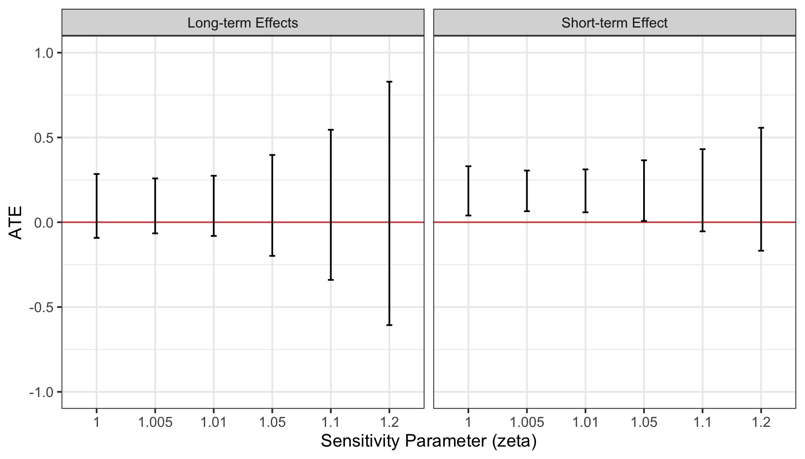
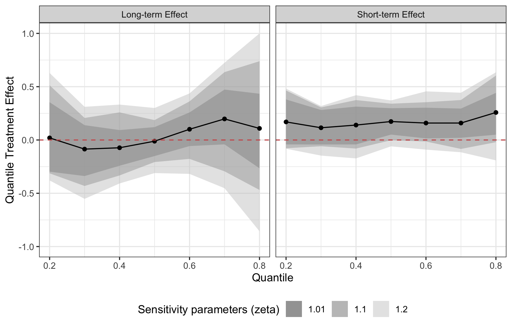

<!-- README.md is generated from README.Rmd. Please edit that file -->

# attrition

<!-- badges: start -->

[](https://github.com/soichiroy/attrition/actions)
[](https://www.tidyverse.org/lifecycle/#experimental)
<!-- badges: end -->

The goal of attrition is to …

## Installation

You can install the released version of attrition from
[CRAN](https://CRAN.R-project.org) with:

``` r
install.packages("attrition")
```

And the development version from [GitHub](https://github.com/) with:

``` r
# install.packages("devtools")
devtools::install_github("soichiroy/attrition")
```

## Estimate Average Treatment Effect

``` r
# load packages
require(tidyverse)
require(attrition)
require(knitr)
```

``` r
## data
dat_use <- market %>%
  filter(treatment %in% c("Control", "UK", "US", "EU", "short")) %>%
  mutate(D = ifelse(treatment == "Control", 0, 1))

## formula
fm1 <- SV_post | D ~
        age_w1 + invest_w1 + risk_1_w1 + equality_1_w1 +
        female_w1 + blame_system_w2 + born_uk_w2 +
        voted_cons_15 + voted_lab_15 + voted_ukip_15 +
        lninc_missing_w2 + SV_pre +
        B_risk_1_pre + B_trust_1_pre + B_equality_1_pre + B_blame_system_pre +
        B_bjw_pre + B_luck_pre + B_religious_w2 + fl_big3_w1 +
        B_jobloss_help_pre

fm2 <- SV_w6 | D ~
        age_w1 + invest_w1 + risk_1_w1 + equality_1_w1 +
        female_w1 + blame_system_w2 + born_uk_w2 +
        voted_cons_15 + voted_lab_15 + voted_ukip_15 +
        lninc_missing_w2 + SV_pre +
        B_risk_1_pre + B_trust_1_pre + B_equality_1_pre + B_blame_system_pre +
        B_bjw_pre + B_luck_pre + B_religious_w2 + fl_big3_w1 +
        B_jobloss_help_pre
```

``` r
## IPW estimator
est_att1_ipw <- attrition(formula = fm1, data = dat_use, estimator = "ipw")
est_att2_ipw <- attrition(formula = fm2, data = dat_use, estimator = "ipw")
```

| effects    | estimate | std.error | statistic | p.value |
| :--------- | -------: | --------: | --------: | ------: |
| short-term |    0.152 |     0.077 |     1.981 |   0.056 |
| long-term  |    0.094 |     0.101 |     0.935 |   0.258 |

### Compute Sensitivity-Aware Confidence Intevals

``` r
## compute bounds and confidence intervals 
set.seed(1234)
zeta_vec <- c(1, 1.005, 1.01, 1.05, 1.1, 1.2)
bd1 <- attrition_bound(fm1, data = dat_use, qoi = 'ate', zeta = zeta_vec,
                       options = list(ci = TRUE, n_boot = 200))
bd2 <- attrition_bound(fm2, data = dat_use, qoi = 'ate', zeta = zeta_vec,
                       options = list(ci = TRUE, n_boot = 200))
```

``` r
bd_ate <- bind_rows(
  bd1 %>% mutate(effects = "Short-term Effect"),
  bd2 %>% mutate(effects = "Long-term Effects")
) 

ggplot(bd_ate, aes(x = factor(zeta))) +
  geom_hline(yintercept = 0, color = 'indianred') +
  geom_errorbar(aes(ymin = CI90_LB, ymax = CI90_UB), width = 0.1) +
  theme_bw() +
  ylim(-1, 1) +
  labs(x = "Sensitivity Parameter (zeta)", y = 'ATE') +
  theme(plot.title = element_text(hjust = 0.5)) + 
  facet_wrap(~effects)
```



## Estimating Quantile Treatment Effect

``` r
zeta_vec <- c(1, 1.01, 1.1, 1.2)
probs    <- seq(0.2, 0.8, by = 0.1)
set.seed(1234)
bd1_qte <- attrition_bound(fm1, data = dat_use, qoi = 'qte', zeta = zeta_vec,
                           probs = probs, options = list(ci = TRUE, n_boot = 250))
bd2_qte <- attrition_bound(fm2, data = dat_use, qoi = 'qte', zeta = zeta_vec,
                           probs = probs, options = list(ci = TRUE, n_boot = 250))
```

``` r
bd_qte <- bind_rows(
  bd1_qte %>% mutate(effects = "Short-term Effect"),
  bd2_qte %>% mutate(effects = "Long-term Effect")
) %>% mutate(CI90_UB = pmin(CI90_UB, 1))
  

ggplot(bd_qte %>% filter(zeta != 1), aes(x = probs)) + 
  geom_ribbon(aes(ymin = CI90_LB, ymax = CI90_UB, fill = factor(zeta)), alpha = 0.5) + 
  geom_line(data = bd_qte %>% filter(zeta == 1), aes(x = probs, y = LB)) + 
  geom_point(data = bd_qte %>% filter(zeta == 1), aes(x = probs, y = LB)) + 
  geom_hline(yintercept = 0, linetype = 'dashed', color = 'indianred') + 
  scale_fill_manual(values = c("gray20", "gray50", "gray80")) + 
  ylim(-1, 1) + 
  theme_bw() +
  labs(y = "Quantile Treatment Effect", x = "Quantile", fill = 'Sensitivity \n parameters') + 
  facet_wrap(~effects)
```


